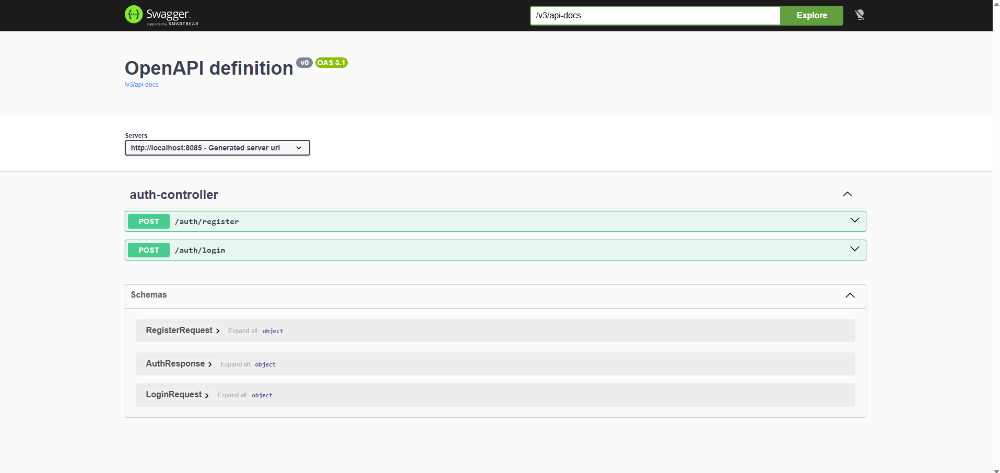
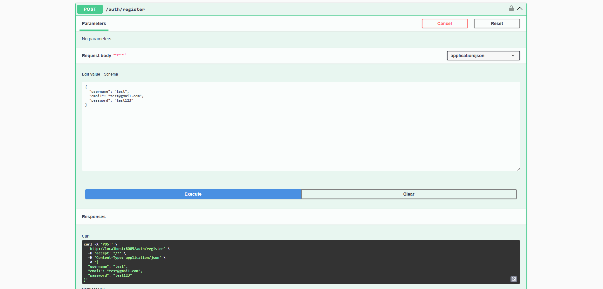
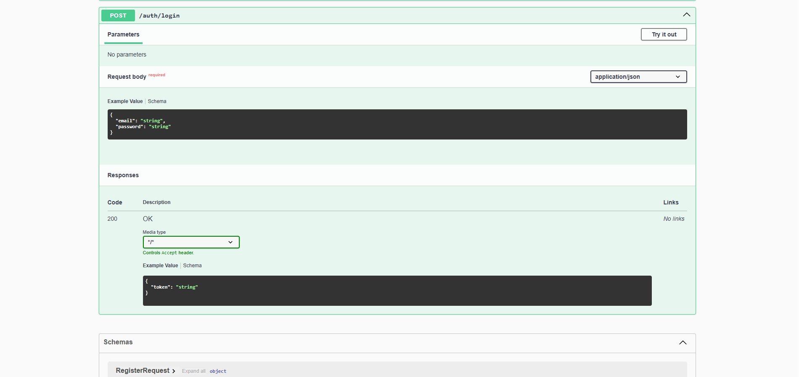
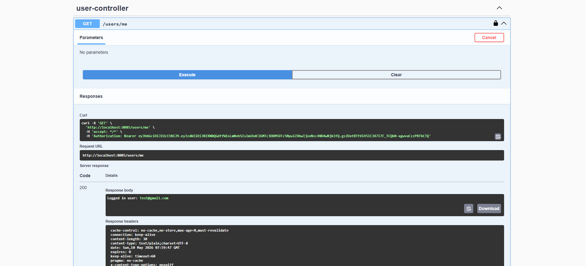
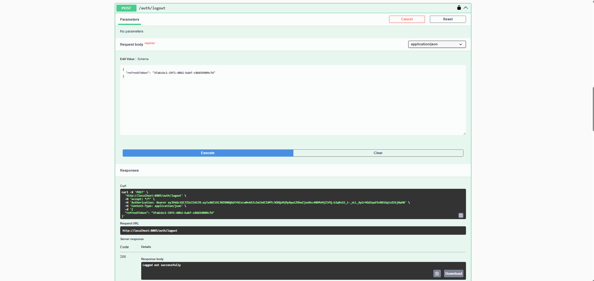

# EnterpriseAuth Starter 🚀

Production-ready Spring Boot JWT Authentication Starter Kit built with Spring Boot 3, Spring Security 6, PostgreSQL, JWT, Refresh Tokens, Role-Based Authorization, and Docker-ready architecture.

EnterpriseAuth Starter provides a scalable and reusable authentication foundation for enterprise-grade backend applications.

---

# ✨ Features

## 🔐 Authentication
- JWT Authentication
- Stateless Authentication
- Access Token + Refresh Token Architecture
- User Registration API
- User Login API
- Refresh Token Authentication
- Logout Token Revocation
- Session Lifecycle Management

---

## 🛡️ Authorization
- Role-Based Authorization
- USER / ADMIN Roles
- Role Hierarchy Support
- Protected REST APIs
- Method-Level Security with `@PreAuthorize`

---

## 🔒 Security
- Spring Security 6
- JWT Authentication Middleware
- Custom JWT Authentication Filter
- SecurityContext Integration
- BCrypt Password Encryption
- Global Security Configuration
- Custom UserDetailsService

---

## ⚠️ Exception Handling
- Global Exception Handling
- Structured API Responses
- Professional Error Responses
- Validation Exception Handling
- Custom Exception Classes

---

## ✅ Validation
- Jakarta Validation
- Email Validation
- Password Validation
- Request Payload Validation

---

## 🗄️ Database
- PostgreSQL Integration
- Spring Data JPA
- Hibernate ORM
- UUID-Based Primary Keys
- Audit Fields (`createdAt`, `updatedAt`)

---

## 📘 API Documentation
- Swagger / OpenAPI Integration
- Swagger JWT Authorization Support

---

## 🏗️ Architecture
- RESTful API Architecture
- Clean Enterprise Project Structure
- Modular Package Organization
- Production-Ready Design

---

## 🚀 DevOps
- Docker Ready
- Environment Variable Support
- Kubernetes Ready (Upcoming)

---

# 🏛️ Security Architecture

EnterpriseAuth Starter follows enterprise-grade stateless JWT authentication architecture.

## Authentication Flow

```text
User Login
    ↓
Generate Access Token + Refresh Token
    ↓
Access Protected APIs
    ↓
Access Token Expires
    ↓
Refresh Token Generates New Access Token
    ↓
Logout Revokes Refresh Token
```

---

# 🧰 Tech Stack

## Backend
- Java 21
- Spring Boot 3.x
- Spring Security 6
- Spring Data JPA
- Hibernate

## Authentication
- JWT (JSON Web Token)
- BCrypt Password Encryption

## Database
- PostgreSQL

## Documentation
- Swagger / OpenAPI

## Build Tool
- Maven

## DevOps
- Docker
- Kubernetes (Upcoming)

---

# 📂 Project Structure

```text
src/main/java/com/enterpriseauthstarter
│
├── auth
│   ├── controller
│   ├── dto
│   ├── entity
│   ├── repository
│   ├── security
│   └── service
│
├── admin
│   └── controller
│
├── user
│   └── controller
│
├── config
├── exception
├── common
└── util
```

---

# ▶️ Run Application

## Clone Repository

```bash
git clone https://github.com/srini2107/enterpriseauth-starter.git
```

---

## Configure PostgreSQL

Update:

```yaml
application.yml
```

```yaml
spring:
  datasource:
    url: jdbc:postgresql://localhost:5432/enterprise_auth_db
    username: postgres
    password: root
```

---

## Run Application

```bash
./mvnw spring-boot:run
```

Application runs on:

```text
http://localhost:8085
```

---

# 🐳 Docker Support

## Build JAR

```bash
./mvnw clean package
```

---

## Build Docker Image

```bash
docker build -t enterpriseauthstarter .
```

---

## Run Docker Container

```bash
docker run -p 8085:8085 enterpriseauthstarter
```

---

# 📘 Swagger Documentation

Swagger UI:

```text
http://localhost:8085/swagger-ui.html
```

---

# 🔑 JWT Authentication

## Swagger Authorization Flow

1. Register or Login
2. Copy generated Access Token
3. Click **Authorize** in Swagger
4. Add token:

```text
Bearer your_access_token
```

---

# 📌 API Endpoints

## Authentication APIs

| Method | Endpoint | Description |
|--------|----------|-------------|
| POST | `/auth/register` | Register a new user |
| POST | `/auth/login` | Authenticate user |
| POST | `/auth/refresh` | Generate new access token |
| POST | `/auth/logout` | Logout and revoke refresh token |

---

## User APIs

| Method | Endpoint | Description |
|--------|----------|-------------|
| GET | `/users/me` | Get logged-in user details |

---

## Admin APIs

| Method | Endpoint | Description |
|--------|----------|-------------|
| GET | `/admin/dashboard` | Admin-only protected API |

---

# ✅ Standard API Response Format

## Success Response

```json
{
  "success": true,
  "message": "Request successful",
  "data": {}
}
```

---

## Error Response

```json
{
  "success": false,
  "message": "Invalid credentials",
  "data": null
}
```

---

# ✅ Sample Requests

## Register Request

```json
{
  "username": "jack",
  "email": "jack@gmail.com",
  "password": "password123"
}
```

---

## Login Request

```json
{
  "email": "jack@gmail.com",
  "password": "password123"
}
```

---

## Authentication Response

```json
{
  "accessToken": "eyJhbGciOiJIUzI1NiJ9...",
  "refreshToken": "550e8400-e29b..."
}
```

---

# ⚠️ Validation Error Response

```json
{
  "success": false,
  "message": "Invalid email format",
  "data": null
}
```

---

# 📸 Screenshots

## Swagger UI


---

## Register API


---

## Login API


---

## Protected API


---

## Validation Error


---

## Refresh Token API


---

## Logout API


---

# 🚀 Upcoming Features

- Redis Token Blacklist
- Email Verification
- Password Reset
- OAuth2 Google Login
- GitHub Actions CI/CD
- Kubernetes Deployment
- AWS Deployment
- Multi-Device Session Management
- Rate Limiting
- API Gateway Integration

---

# 🤝 Contribution

Contributions, suggestions, and improvements are welcome.

---

# 📄 License

This project is licensed under the MIT License.

---

# ⭐ Support

If you found this project useful, please consider giving it a ⭐ on GitHub.
